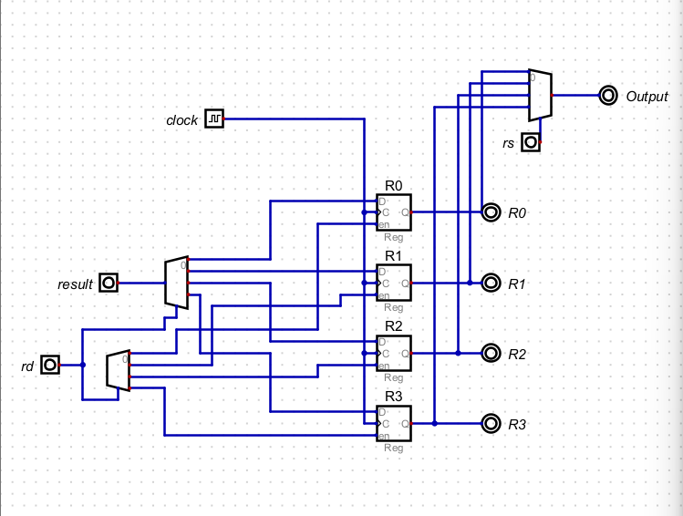

# 16-Bit RISC CPU with 32 Instructions

A 16-bit RISC CPU with 32 instructions, built with [Digital](https://github.com/hneemann/Digital).

## Description

This CPU is built from scratch using a digital circuit simulator called [Digital](https://github.com/hneemann/Digital). The design can be exported to Verilog or VHDL, which allows it to be synthesized into a digital circuit suitable for deployment on an [FPGA](https://en.wikipedia.org/wiki/Field-programmable_gate_array).

## Design

A [minimal instruction set computer](https://en.wikipedia.org/wiki/Minimal_instruction_set_computer) architecture featuring exactly 32 instructions.

- RISC instruction set with a Harvard memory architecture.
- Separate program and data memory.
- Two pipeline stages: fetch and execute.
- Designed for ice40 FPGAs using an open-source toolchain.

### Instruction Set

See [Instruction Set Documentation](./docs/instructions.md).

## Register File

A **register file** is a fast-access storage unit containing registers for temporary data during instruction execution. It works closely with the **Arithmetic Logic Unit (ALU)**.

### Functionality

- Each register file has a **register destination (rd)** connected to the **Program Counter (PC)**.
- The **execution unit** output (result signal) is fed into a **multiplexer** controlled by `rd`.
- `rd` also goes into a **decoder**, which enables the correct register based on its value.
- A second multiplexer, controlled by **register source (rs)**, reads data from the selected register.

## Execution Unit

The **execution unit** includes a **full adder circuit** and an `add` signal.

### Operation

- `add` acts as a **select line** for a multiplexer.
- When `add = 1`, the multiplexer selects the adder output for addition.
- When `add = 0`, the multiplexer outputs the value of **input B** directly.

## Decoder Unit

The **decoder unit** interprets the 16-bit instruction and routes signals accordingly.

### Instruction Breakdown

- **Bits 0–15**: Operand (**A**)
- **Bits 16–17**: Destination register (**rd**)
- **Bits 20–21**: Source register (**rs**)
- **Bits 24–26**: Instruction code

### Decoding Logic

- `000` → Execute **add**
- `111` → Execute **jump**

## Fetch Block

The **fetch block** retrieves instructions and manages control flow.

### Inputs

- **instruction**: Retrieved from **EEPROM**
- **bypass**: Bypasses EEPROM if programming mode is enabled
- **prog**: Selects between `bypass` and `instruction`
- **address**: Loads the **Program Counter (PC)** during a jump
- **jump**: Triggers PC load

The counter only loads the address when a **jump** instruction is active.

## Assembler

The **assembler** constructs 32-bit instruction words from individual components.

### Functionality

- Supports instructions such as **add** and **jump**
- Uses a **priority encoder** to select the active instruction
- Outputs instructions to **EEPROM**
- Programming mode (`mode`) enables the write clock signal

## Building and Running

- For simulation, open `dig/frontpanel.dig` in [Digital](https://github.com/hneemann/Digital)
- For Verilog, see the [HDL documentation](./hdl/README.md)

## Acknowledgments

- [rj45](https://github.com/rj54)
